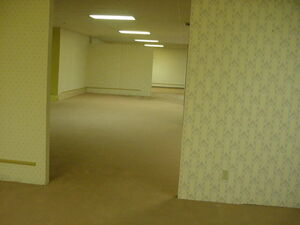

# The Backrooms Twine
A Twine project based on the online urban legend The Backrooms. 

[To play click here](https://rodali.github.io/the-backrooms-twine/)

For more information on The Backrooms see:
- https://en.wikipedia.org/wiki/The_Backrooms
- https://backrooms.fandom.com/wiki/Backrooms_Wiki
- http://backrooms-wiki.wikidot.com/

This began as a final project in the course INF2331 - The Future of The Book (UofT).
